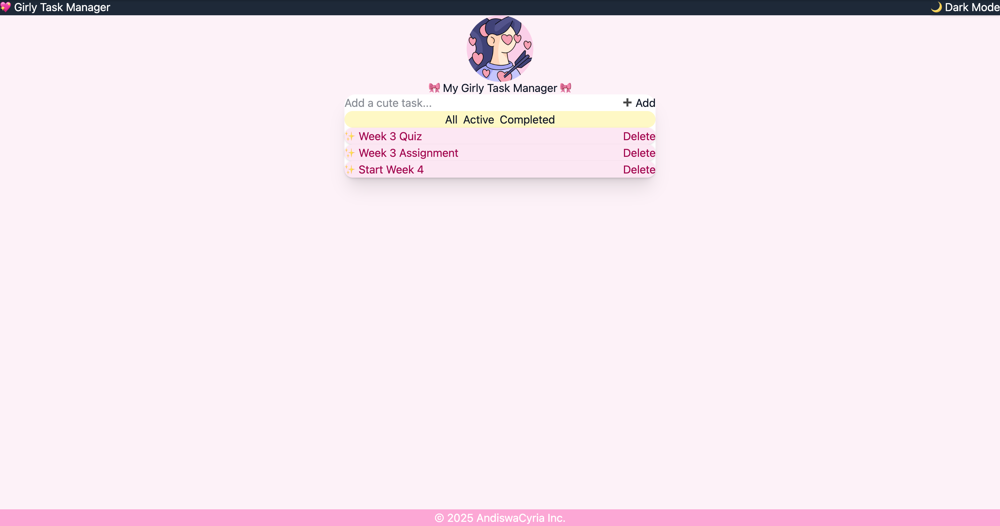

# 🎀 Girly Task Manager

A cute and functional task manager built with **React**, **Tailwind CSS**, and **localStorage** for persistent tasks. Designed with a soft pink theme and supports dark mode for extra flair. ✩️💗

---

## 🧠 Features

* ✅ Add new tasks
* ✅ Mark tasks as complete/incomplete
* ✅ Tasks saved in `localStorage` (persistent on refresh)
* ✅ Dark Mode Toggle 🌙/🌞
* ✅ Responsive & mobile-friendly
* ✅ Custom Playfair Display font
* ✅ Girly-themed UI with Tailwind CSS 💅
* ✅ Task list styled as a cute table layout

---

## 🛠️ Technologies Used

* [React](https://reactjs.org/)
* [Tailwind CSS](https://tailwindcss.com/)
* [Vite](https://vitejs.dev/)
* [localStorage](https://developer.mozilla.org/en-US/docs/Web/API/Window/localStorage)

---

## 🚀 Getting Started

### 1. Clone the repository

```bash
git clone https://github.com/your-username/girly-task-manager.git
cd girly-task-manager
```

### 2. Install dependencies

```bash
pnpm install
```

> If you don't have `pnpm`, install it with:
>
> ```bash
> npm install -g pnpm
> ```

### 3. Start the development server

```bash
pnpm run dev
```

Visit [http://localhost:5173](http://localhost:5173) in your browser.

---

## 🗂️ Project Structure

```
src/
├── components/
│   ├── Button.jsx
│   ├── Footer.jsx
│   ├── Navbar.jsx
├── App.jsx
├── Layout.jsx
├── main.jsx
├── index.css
```

---

## 📸 Screenshot



---

## 📦 Deployment

This project can be easily deployed to:

https://week3-c34m36zpd-andiswa-cyria-molangathi-s-projects.vercel.app/

* **Vercel**
* **Netlify**
* **GitHub Pages (with Vite config tweak)**

---

## 💡 Customization Ideas

* Add task filtering (All, Completed, Pending)
* Add task editing functionality
* Add categories/tags for tasks
* Animate task transitions using `framer-motion`

---

## 🧁 Author

Built with love by **AndiswaCyria** 💖

> Frontend Dev | React Enthusiast | Lover of Cute UI 🍭

---

## 📄 License

This project is open source and available under the [MIT License](LICENSE).
